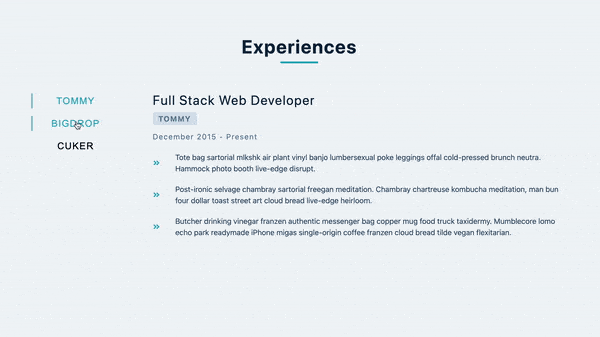

## Summary

Render company buttons dynamically and sync company buttons with job descriptions.

[Live Demo](https://christy313.github.io/react15-project06)



Ref: [Portfolio](https://gatsby-strapi-portfolio-project.netlify.app/)

## File structure

```
.
├── README.md
└── src
    ├── App.js
    ├── components
    │   ├── CompanyButtons.js
    │   ├── JobInfo.js
    │   ├── Loading.js
    │   └── Title.js
    ├── index.css
    └── index.js
```

## Available Scripts

In the project directory, you can run:

### `npm start`

Runs the app in the development mode.\
Open [http://localhost:3000](http://localhost:3000) to view it in your browser.
